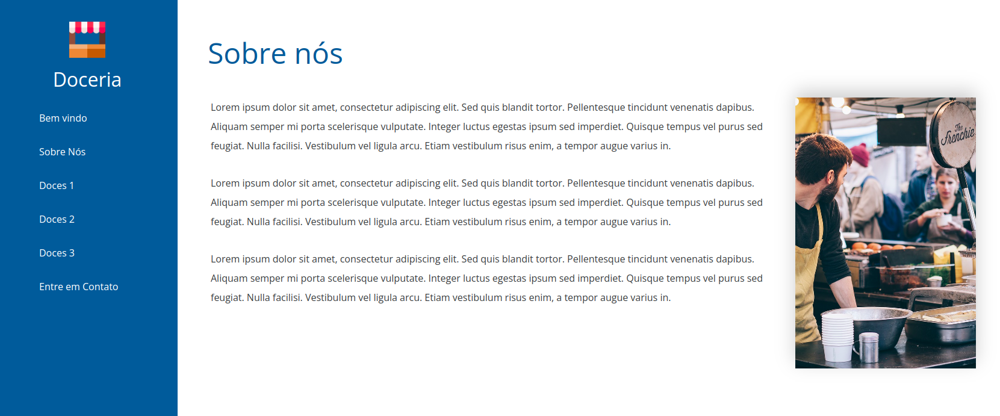

# 
 :cake: Doceria :cake: 

## :bookmark_tabs: Sobre

  
<strong> Informações gerais sobre o Projeto</strong>
 

Projeto voltado para relembrar conceitos de CSS3 e HTML5 desenvolvido por [Yasmim Matos](https://www.linkedin.com/in/yasmimmatos/) construído com base no curso [HTML5 e CSS3: Técnicas Avançadas](https://www.udemy.com/course/html5-e-css3-tecnicas-avancadas-com-flexbox-e-3-projetos/) da plataforma Udemy com o foco em desenvolver uma página inicial de uma doceria.

[Clique Aqui](https://doceria-ivory.vercel.app/) para visualizar o projeto no seu navegador.

## :toolbox: Ferramentas Utilizadas

  
<strong> Principais Ferramentas</strong>
 
 
* CSS3
* HTML5

## :desktop_computer: Demonstração do Projeto

  
<strong> Tela do Projeto</strong>
 

  
  
  
  
  

